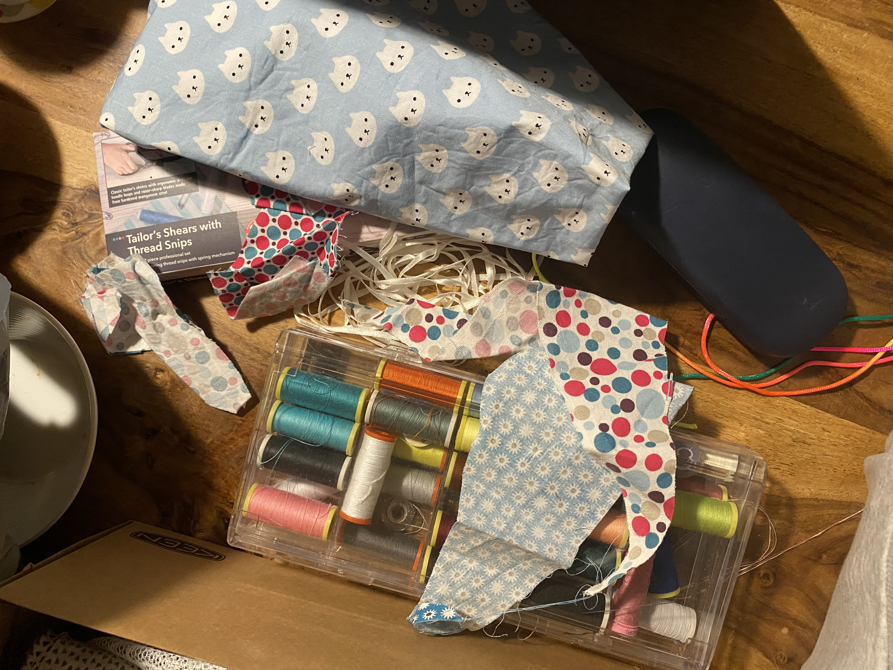

# 📝 Homework 1: Bespoke Character

## What I worked on

Our homework was to design a bespoke character from the modern English alphabet:

- Choose a single letterform (A–Z)
- Use any style: lowercase or uppercase, sans-serif or serif, cursive, fantasy, etc.
- Use any technique: hand-drawn, analog, digital, or mixed media

I knew I wanted to sew something, but I wasn't sure what. My first step was to browse the fabrics, and a cat-patterned one immediately caught my eye. Inspired by the material, I decided on a cat-related project. This led to the idea of creating a letter 'C' that functions as both a cat toy and a bookmark. For my next assignment, I expanded on the bookmark idea by creating a cat poem. (this will lead to the cat poem page)

---

## Work in progress🧵🪡

## This is the final project!

