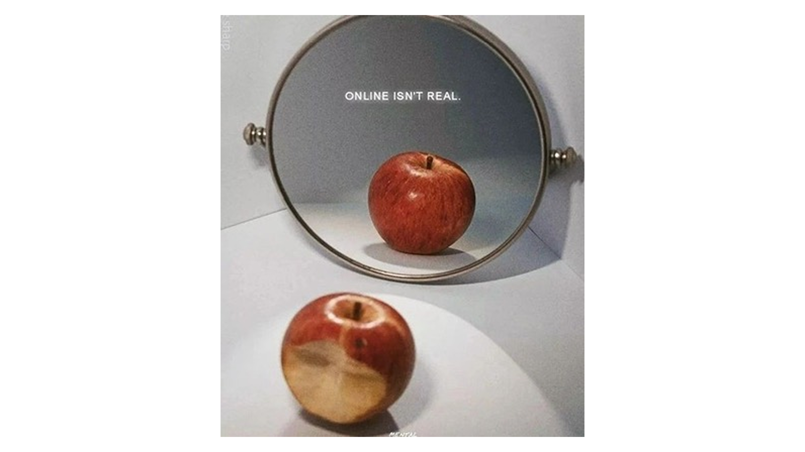

# Today I learned

We're online all the time. I've been thinking lately, and I want you to think about one thing too:
When was the last time you did something for yourself? When did you do something because it excited you or made you feel good?
I mean, look at it — you went on a coffee date, and before you drank your first sip of that overpriced coffee, you took a picture. I saw it in your highlights later. Were you even there? Were you present for yourself? Or did you, again, share the coffee with the whole world just to show everyone how happy you are and how perfect your life is?

How much did you enjoy the run? Did you run the marathon just so you could get the medal afterwards and take a picture with it? Or did you go for a run because it makes you feel good and you want to get better?
How pathetic is it? Imagine this: it's 1984 and you go to a coffee shop to get a cup of coffee. You take your Polaroid with 20 black-and-white films with you and take all 20 pictures of your coffee. What would you do with them? Put all the pictures in envelopes and randomly drop them in strangers' mailboxes with a note saying #coffeedate? It sounds crazy, doesn't it?
But that's our reality. Constantly sharing how perfect our lives are just so someone can look at them and feel miserable — just like you do when you look at theirs.
Send the pictures to your mom, send them to your dad, your best friends. Tell them how you've been and add the pictures to illustrate it, since you can and don't have to send them one of just 20 Polaroids.

So my message is: be visible, use social media for work, for growing your business — but please, remember to live a little. Outside your phone. There's so much more this world has to offer than just sharing your life and ruining other people's lives, including your own. Be present. Live in the moment. Do it for yourself.
Share the joy with your loved ones, not with the invisible ones.

And please, remember one thing. Online isn't real.

 
[Go back to Home](./)
