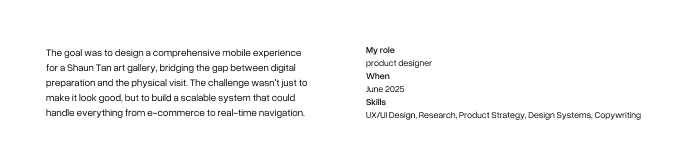
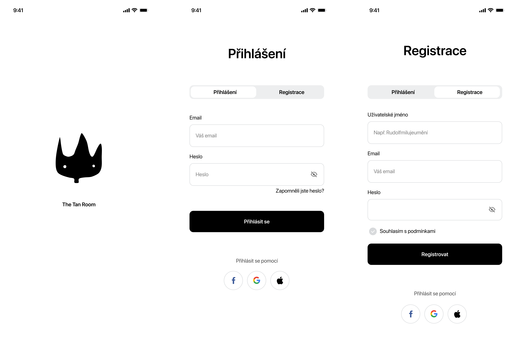

# Case Study

## From Silent Walk into a Shared journey/ Transforming a Silent Walk into a Shared Journey / 30 Seconds that Lead to a 2-Hour Journey

## Meet the hero
To understand the audience, you have to understand teh artist - an australian artist Shaun Tan.
Shaun’s art makes you feel like a 'lost thing' in a vast, beautiful world. My goal was to ensure the technology didn't disrupt that emotional state, but enhanced it.

If you aren't familiar with his work, you can [explore more about him](about-shaun.md) to see the visual anchor to this entire system.

## Feeling Like a “Lost Thing” /Im feeling like a lost thing, and that’s a problem!
(problem intro)
what needed to be solved:

It's a weekend and it's raining outside. You don't want to sit on a couch and want to do something. You heard your favorite gallery has an interesting exhibition. You open their website and learn nothing. It is a mess. You try your luck and go to the gallery. It's closed. No information on the website. Annoying isn't it?

You finally arrived to the gallery but another problem occures. It can be annoying when you're in a gallery wanting to see your favorite artist and suddenly you don't know whee to go. The app helps visitors find their way around easily with no need asking or being lost. It has a navigation system that can talk to you or you can follow the navigation on your screen as you wander through rooms.

## Here comes the savior: the designer!
how I decided to solve the problem

I came up with the idea of creating an app...
I solved the frustration problem by creating an app, that tells you all the information needed and even more! (It navigates you through the gallery as you wander around.)

image of the sketches

## Starting on a Blank Canvas /sketching process
process

- respondents (first thing first)
- wireframes
- key features

- basically drawing with a pencil

image of respondents and their needs
image of wireframes

## Choosing the Right Paints (still part of the process) /from sketches to colors/paints

- basically painting with the colors
- assest, colors etc.
I started by defining the.../as I set what the features will be... from drawing the "sketches" of the app to real paints
applying what I set

image of colors
### The paints I used

image of typography
image of assets

## How I painted the final artwork
the final design, solution
what it provides
- tickets storage
- audio compass
- clean design

guide through the images and inroduce the app

The app provides 

tickets
navigation--> being lost in the labyrinth
since galleries can be ... the goal was to create an app that would lead the visitor through teh gallery smoothly
short gallery labels

## Connecting the wires
= prototyping
image of prototyping process

## 30 Seconds that Lead to a 2-Hour Journey / Transforming a Silent Walk into a Shared Journey

the final look

key takeaway:what I learned
outcome if we don’t have the data/what I learned

[Try the prototype!](https://www.figma.com/proto/7wpjjC9Rh4RkNEgiTwopHB/DD-aplikace-galerie?node-id=189-8061&t=N1YZQwhhy3OGCW7U-1)

[View this case study in Figma ](https://www.figma.com/proto/kths0MtLtwNWRim2aIUroV/English-for-Designers?node-id=287-2648&t=xI8cHyuwxh3LRaBp-1)
 
CTA
Let’s talk. There’s more than a UXUI painting I can do for you!
Portfolio | Linkedin
