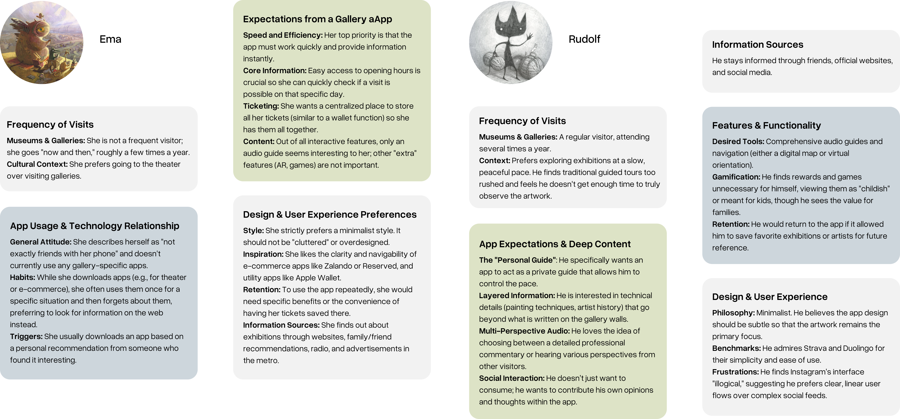
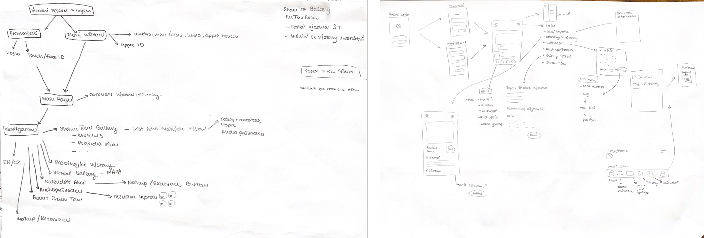
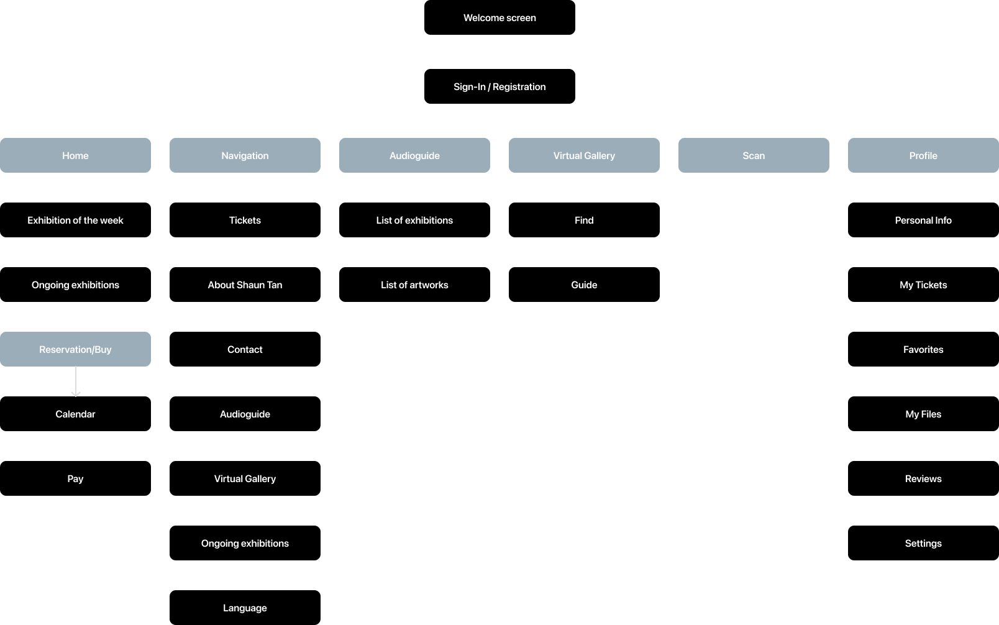
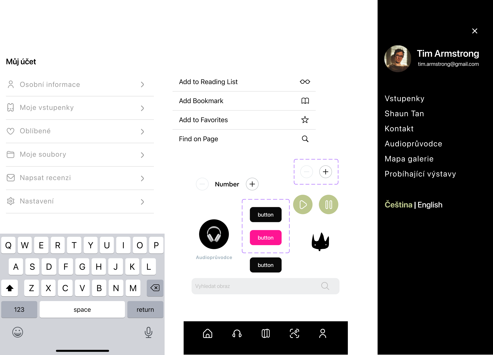
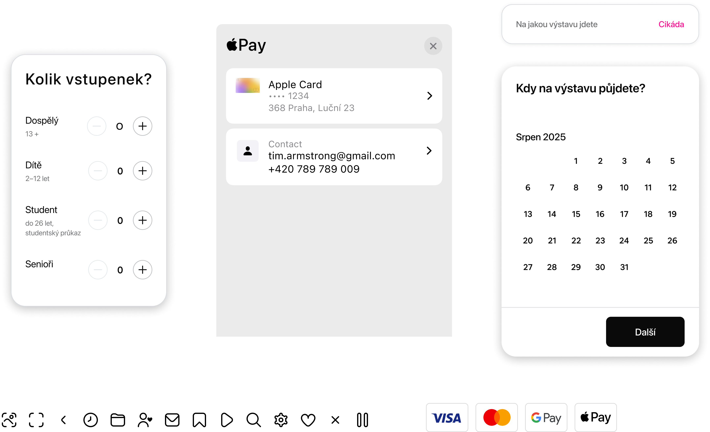
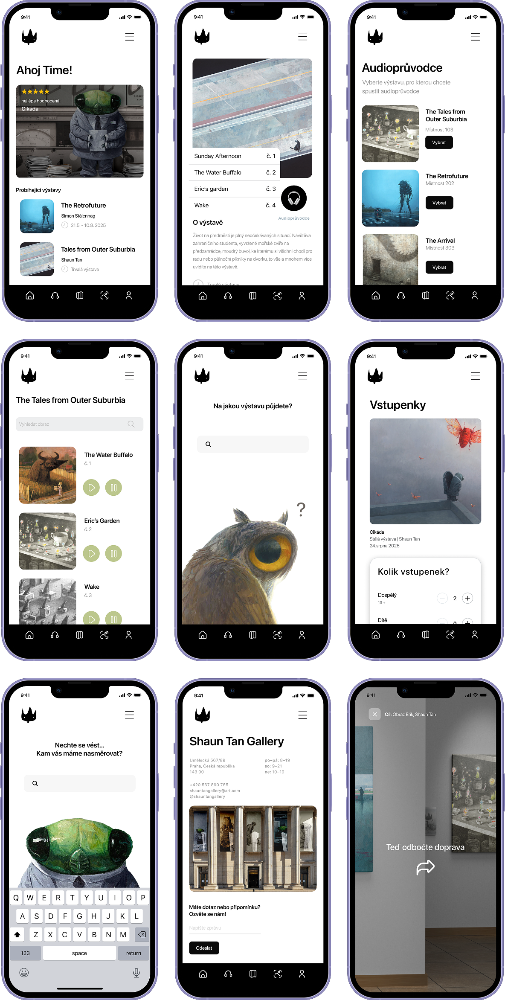

# 30 Seconds that Lead to a 2-Hour Journey
## Designing a gallery companion app for Shaun Tan's surrealist world

| | |
| :--- | :--- |
| **Year** | 2025 |
| **Role** | UX/UI Designer — research, wireframes, visual design, prototype |
| **Type** | School project |
| **Tools** | Figma, pencil + paper |
| **Prototype** | [Try it in Figma →](https://www.figma.com/proto/7wpjjC9Rh4RkNEgiTwopHB/DD-aplikace-galerie?node-id=178-7863&t=N1YZQwhhy3OGCW7U-1) |

*Application screens*

## Meet the hero
To understand the audience, you have to understand teh artist. Shaun Tan is an Australian illustrator whose work feels like being a small, lost thing in a vast and beautiful world. His paintings are quiet, surreal, and full of detail you only notice on the second look.

That quietness became my design constraint. The app couldn't shout. It had to sit beside the art, not on top of it.

If you aren't familiar with his work, you can [explore more about him](about-shaun.md) to see the visual anchor to this entire system.

*Shaun Tan's paintings*

## I'm feeling like a lost thing, and that’s a problem!

It's a weekend and it's raining outside. You don't want to sit on a couch and want to do something. You heard your favorite gallery has an interesting exhibition. You open their website and learn nothing. It is a mess. You try your luck and go to the gallery. It's closed. No information on the website. Annoying isn't it?

You finally arrived to the gallery but another problem occurs. It can be annoying when you're in a gallery wanting to see your favorite artist and suddenly you don't know where to go. The app helps visitors find their way around easily with no need asking or being lost. It has a navigation system that can talk to you or you can follow the navigation on your screen as you wander through rooms.

This is the gap I wanted to close. Not one frustration, but two — **before the visit** and **during the visit** — stitched together by a single app.

## Here comes the savior: the designer!

Two frustrations, one app. The brief I set myself was simple to say and hard to do: design a minimal, real-time companion that solves the logistics *before* the visit and the navigation *during* it — without ever raising its voice above the art.

Shaun Tan’s paintings are incredibly immersive, surreal, and filled with intricate details; the application’s interface needed to act as a quiet frame rather than a loud distraction, ensuring the artwork itself never got lost in a messy digital layout.

> "A busy interface is the enemy of a peaceful gallery visit. The app's job is to disappear once you've found what you need."

## Stepping into the User's Shoes
Before drawing a single line, I had to understand how people actually behave around cultural spaces such as galleries and museums and their apps. I reached out to my respondents and asked them about their habits, expectations and frustrations when using technologies. 

Our conversatiosn were about the frequency of their gallery visits, where they look for information and what they expect from a dedicated gallery application.

Three insights changed the direction of the project:

| Research pillar | What users told me | What it changed in the design |
| :--- | :--- | :--- |
| **Tech relationship** | "I forget single-use apps within a week." | The app needed Apple Wallet-level utility to justify staying installed. |
| **Content depth** | "Guided tours feel rushed — I want to set my own pace." | Layered audio: short labels by default, longer stories on tap. |
| **Visual style** | "I like apps that get out of the way, like Strava or Zalando." | An "invisible UI" — neutral palette, minimal chrome, art front and centre. |

## Starting on a Blank Canvas

With these user expectations, I started sketching. Paper first.

From these sketches, I came up with the core elements that would hold the whole experience together:

- **The info hub** — everything you need *before* arriving: opening hours, ticket reservation, event calendar, digital tickets.
- **The audio compass** — a hands-free guide that talks you through rooms at your own pace, with short labels by default and longer stories when you want them.
- **The invisible frame** — a UI quiet enough that the artwork stays the loudest thing in the room.

### Choosing the Right Paints

Once the structure was set and the wires were connected, it was time to paint the interface of the app. I moved from pencil sketches and low-fidelity wireframes to defining a high-fidelity visual language. This wasn't just about picking the right colors, it was about creating a digital enviroment that felt intuitive, ensuring the UI remained a quiet frame that never competed with the artwork for the user's attention.

### The neutral base
Black, white, and grey form the primary palette. They don't compete with the art; they hold it and let the art breathe.

### The accents
Sage green, soft blue, and a vibrant pink act as wayfinding cues — used sparingly, only where the user needs to be drawn forward.

#### Mixing the Palette
After defining the colors, I focused on the interface's structural elements to ensure the experience remained both clean and highly functional.

SF Pro Display does the typographic work: legible in low gallery light, neutral enough to never call attention to itself.

Every button and asset was designed to be intuitive, allowing the user to navigate with zero learning curve.

## The final painting
With components in place, the wireframes came alive. Three flows do the heavy lifting:

The final design of the app is clean and organises everything around three flows — one for planning the visit, one for navigating it, and one for remembering it.

### Sign In

### Planning the visit (rename it)
The home screen leads with the Exhibition of the Week, followed by a list of ongoing exhibitions. Tap any exhibition and you land in the calendar, where you pick a date, reserve your slot, and buy the ticket without leaving the flow.

A hamburger menu in the top corner holds everything you might need before you arrive: your tickets, information about Shaun Tan, contact details, the audio guide, the virtual gallery map, ongoing exhibitions, and a Czech/English language toggle.

the final design, solution
what it provides
- tickets storage
- audio compass
- clean design

guide through the images and inroduce the app

The app provides 

tickets
navigation--> being lost in the labyrinth
since galleries can be ... the goal was to create an app that would lead the visitor through teh gallery smoothly
short gallery labels

## Connecting the wires
= prototyping
image of prototyping process

## 30 Seconds that Lead to a 2-Hour Journey / Transforming a Silent Walk into a Shared Journey

the final look

key takeaway:what I learned
outcome if we don’t have the data/what I learned

[Try the prototype!](https://www.figma.com/proto/7wpjjC9Rh4RkNEgiTwopHB/DD-aplikace-galerie?node-id=178-7863&t=N1YZQwhhy3OGCW7U-1)

[View this case study in Figma ](https://www.figma.com/proto/kths0MtLtwNWRim2aIUroV/English-for-Designers?node-id=287-2648&t=xI8cHyuwxh3LRaBp-1)
 
CTA
Let’s talk. There’s more than a UXUI painting I can do for you!
Portfolio | Linkedin
