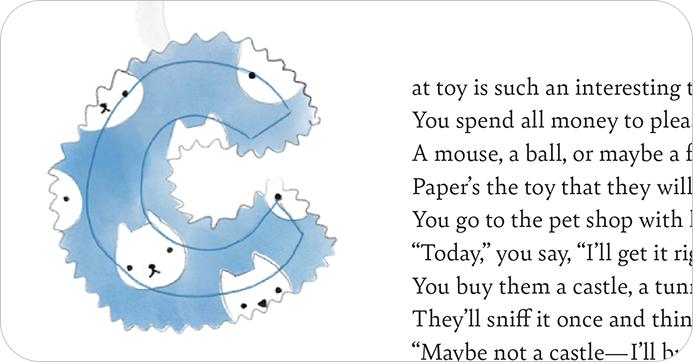
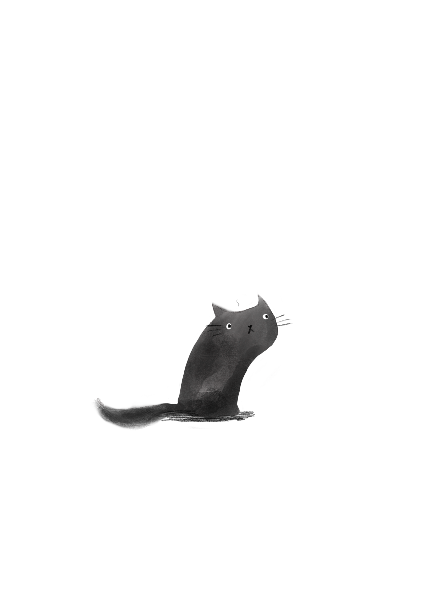
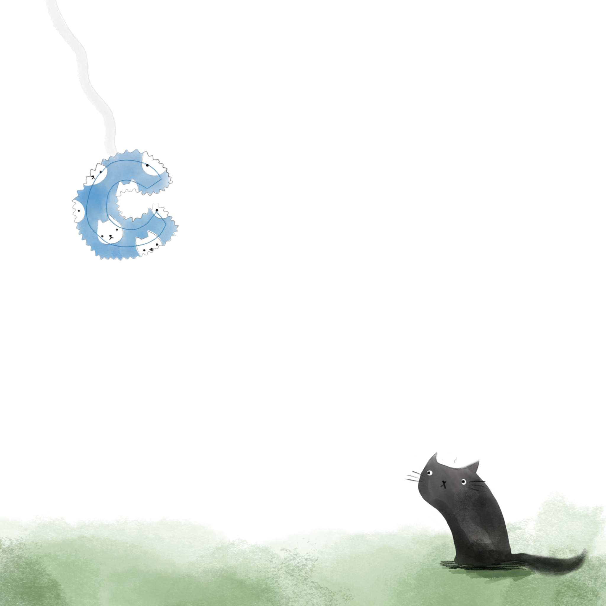

# 📝 Homework 2: Alt text & Type Specimen

## What I worked on

### Part 1: Alt Text

Using your alt text writing experience from in-class:

Write two alt text descriptions without AI assistance. Aim for variety: emotional, technical, concise, and document your iteration process.
Generate two alt text descriptions using AI assistance (ChatGPT, Claude, etc.), then edit and revise them based on the best practices. Document what you changed and why.
Review all four, then synthesize: write one final alt text description that combines the best of what you learned from writing with and without AI assistance.
Document: All five versions with character counts and your iterations (and notes).

#### Work in progress🤓

## Learning the Alphabet with Cats

### Each letter hides a furry story. Fun poems about cats teaching the ABCs the cat way.

---

### Part 2: Type Specimen

Create a typographic composition featuring your bespoke drop cap in a meaningful text context.

Write First

Write an original short text (125–250 words) that features your letter and reflects your relationship to craft, design, typography, the making process, or a recent topic that interests you. Write it yourself — no AI, no copying. Use clear, direct language that people would actually want to read.

Note: Quality over quantity. 125 meaningful words beat 250 of filler text.

Design Second

Create a typographic composition that brings together your drop cap and your written text.

# What I worked on
I decided that I will writre a poem.

### Some ideas🤔💭

cat toy

cat toy is such an interesting thing. You spend all your dollars/money to please your furry friends, while they enjoy playing with paper rends /while all they enjoy is playing with paper tends 
it can be little mouse, ball or a feather, all of them seems to make them deter
give them a little piece of your written all over paper, because that’s the toy they are gonna prefer. 

A cat toy is such an interesting thing
You spend all money to please your furry king,
A mouse, a ball, or maybe a feather, 
paper’s the toy that they will love forever.
You go to the pet shop with hopeful delight,
Today, you say, I’ll get it right!
You buy them a castle, a tunnel, a tree,
They’ll sniff it once and think, not for me.
Maybe not a castle - I’ll buy them a mouse!
You pay and then come back to the house.
Once you’re home with the mouse and want to brag,
Kitty just turns around and takes a nap.
So next time you want to spend your money
The joke’s on you-and it= s pretty funny
Remember the homework Mr. Justin assigned-
That letter makes a cat toy, perfectly designed.

Pretty please, don’t even bother

Think of the homework Mr Justin just gave us
That letter is a cat toy that we may discuss

A cat toy is such an interesting thing. You spend all money to please your furry king. A mouse, a ball, or maybe a feather, paper’s the toy that they will love forever.
You go to the pet shop with hopeful delight, “today”, you say, “I’ll get it right!” You buy them a castle, a tunnel, a tree, they’ll sniff it once and think, “not for me.”
“Maybe not a castle - I’ll buy them a mouse!” You pay and then come back to the house.
Once you’re home with the mouse and want to brag, kitty just turns around and takes a nap.
So next time you want to spend your money, the joke’s on you-and it s pretty funny.
Remember the homework Mr. Justin assigned. That letter makes a cat toy, perfectly designed.

## Illustrations🫟✏️

[Go back to Home](README.md)

