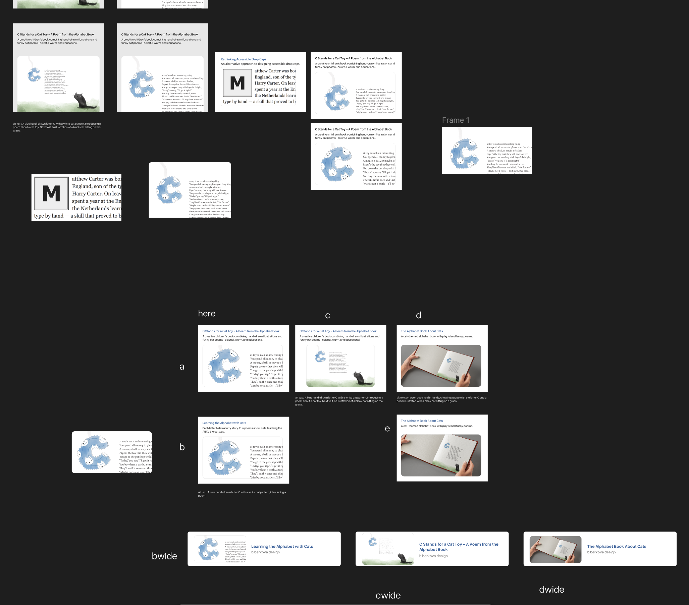
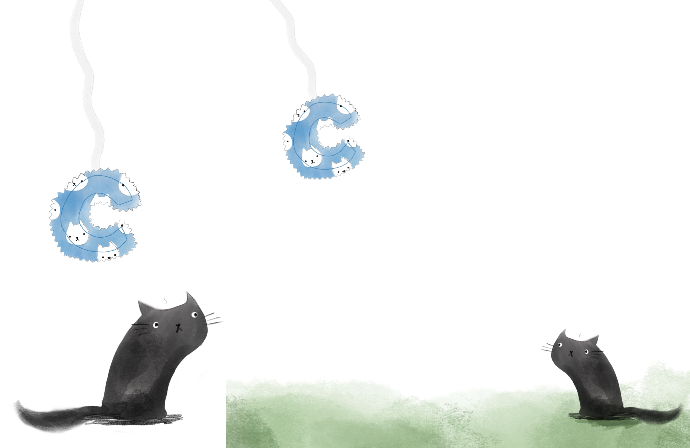
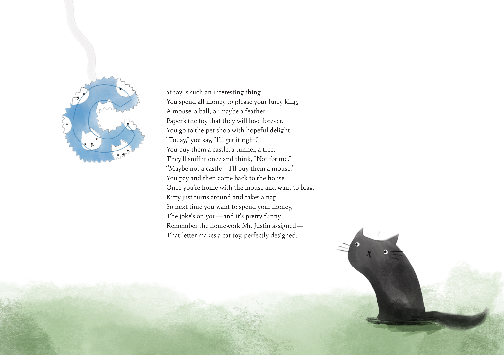

# 📝 Homework 2: Alt text & Type Specimen

## What I worked on
I worked on creating Alt texts. Writing on my own and using ChatGPT.
Then I wrote an original short text that features my letter and reflects my relationship to craft, design, typography, the making process, or a recent topic that interests me. Afterwards, I created a typographic composition that brings together my drop cap and my text.

### Part 1: Alt Text

#### Work in progress🤓

# Alt texts
1) A handmade, blue fabric ornament in the shape of the letter C with white cat faces lying on a wooden surface.

2) Hand-sewn letter C bookmark made out of blue fabric with white cat heads on a beaded ribbon lying on a wooden surface.

## AI 
1) A handmade, light blue fabric ornament in the shape of the letter "C," featuring a pattern of white cat faces, resting on a light wood surface.

2) A hand-sewn letter "C" bookmark crafted from blue cat-print fabric, attached to a white beaded ribbon and displayed on a wooden tabletop.

---

### Part 2: Type Specimen

This was such a fun task. I decided to write a poem and draw some additional pictures. 

### Some poem ideas🤔💭

cat toy

cat toy is such an interesting thing. You spend all your dollars/money to please your furry friends, while they enjoy playing with paper rends /while all they enjoy is playing with paper tends 
it can be little mouse, ball or a feather, all of them seems to make them deter
give them a little piece of your written all over paper, because that’s the toy they are gonna prefer. 

A cat toy is such an interesting thing
You spend all money to please your furry king,
A mouse, a ball, or maybe a feather, 
paper’s the toy that they will love forever.
You go to the pet shop with hopeful delight,
Today, you say, I’ll get it right!
You buy them a castle, a tunnel, a tree,
They’ll sniff it once and think, not for me.
Maybe not a castle - I’ll buy them a mouse!
You pay and then come back to the house.
Once you’re home with the mouse and want to brag,
Kitty just turns around and takes a nap.
So next time you want to spend your money
The joke’s on you-and it's pretty funny
Remember the homework Mr. Justin assigned-
That letter makes a cat toy, perfectly designed.

Pretty please, don’t even bother

Think of the homework Mr Justin just gave us
That letter is a cat toy that we may discuss

A cat toy is such an interesting thing. You spend all money to please your furry king. A mouse, a ball, or maybe a feather, paper’s the toy that they will love forever.
You go to the pet shop with hopeful delight, “today”, you say, “I’ll get it right!” You buy them a castle, a tunnel, a tree, they’ll sniff it once and think, “not for me.”
“Maybe not a castle - I’ll buy them a mouse!” You pay and then come back to the house.
Once you’re home with the mouse and want to brag, kitty just turns around and takes a nap.
So next time you want to spend your money, the joke’s on you-and it s pretty funny.
Remember the homework Mr. Justin assigned. That letter makes a cat toy, perfectly designed.

## Illustrations🫟✏️

## Final poem📄🙌🏻

[Go back to Home](./)

