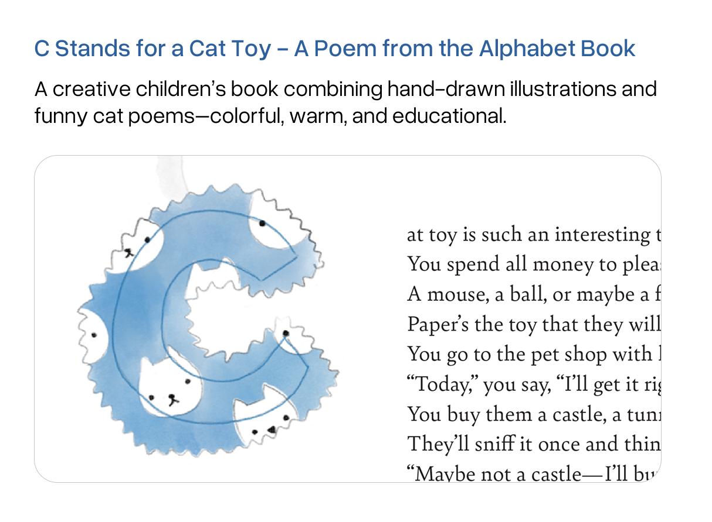
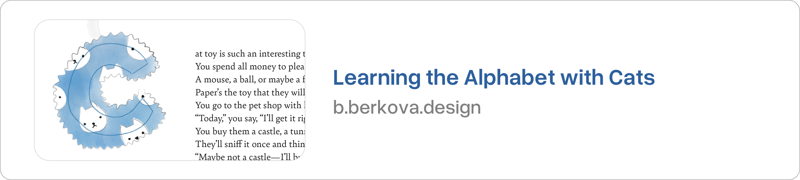
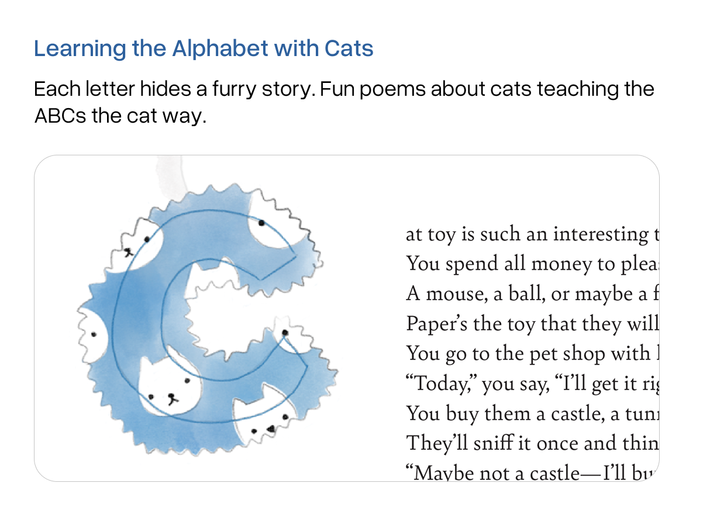
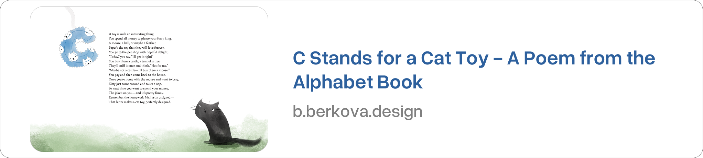
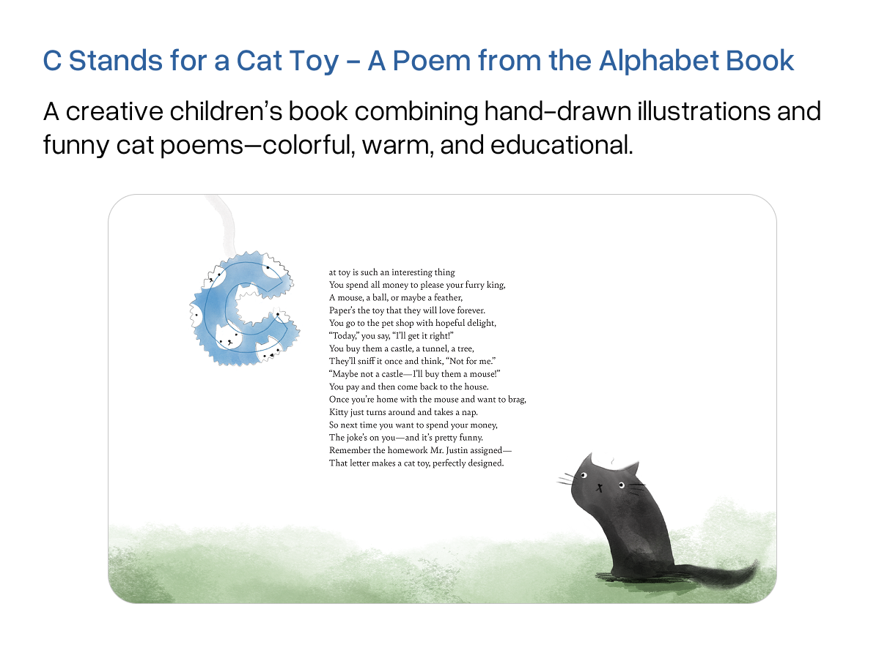

# 📝 Homework 3: Metadata and Preview Image Variations

## What I worked on

I created versions of metadata and preview images for my type specimen.

---

## Preview Image Variations

[Go back to Home](./)
