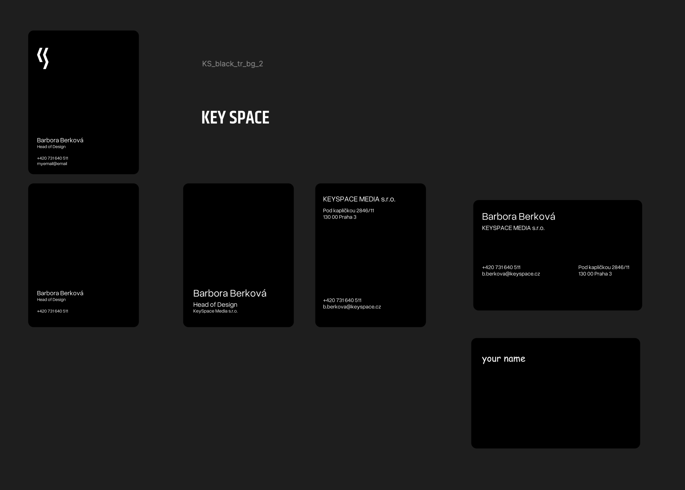
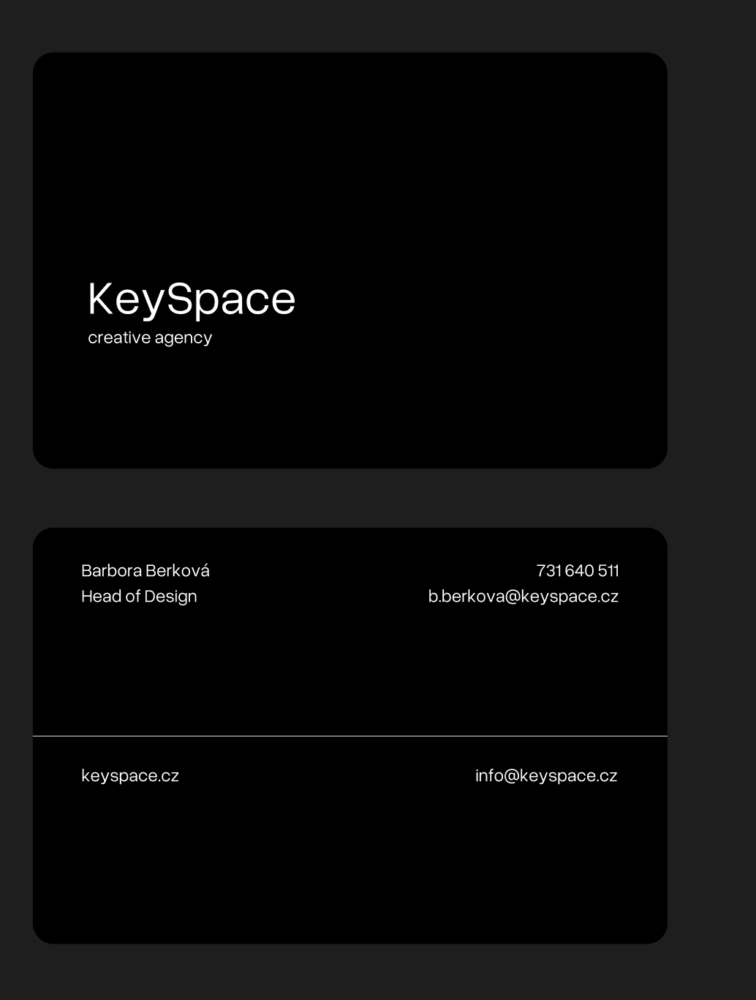
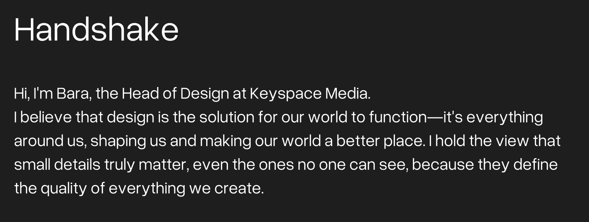

# 📝 Homework 6: Business Card & Handshake

## What I worked on

# Business Card

In class, we were tasked with designing personal business cards. Since we already have existing cards for our agency, it was a unique challenge to develop a completely new concept. I began the process by creating digital sketches in Figma before transferring the final card design to paper.

## Figma sketches

## Result

add a photo of the card

# Handshake

## First version

Hi, I'm Bara, the Head of Design at Keyspace Media. 
I believe that design is the solution for our world to function—it's everything around us, shaping us and making our world a better place. I hold the view that small details truly matter, even the ones no one can see, because they define the quality of everything we create.

## Another version (for the main page)
I’m Barbora Berková, Head of Design at Keyspace Media.

I am a multidisciplinary designer dedicated to transforming complex ideas into clear, meaningful visual stories. I believe design is a vital component of how our world functions, and I thrive in collaborative environments where we create solutions that feel both intentional and human.

If you'd like to connect or discuss a project, you can reach me at [contact info].

[Go back to Home](README.md)

