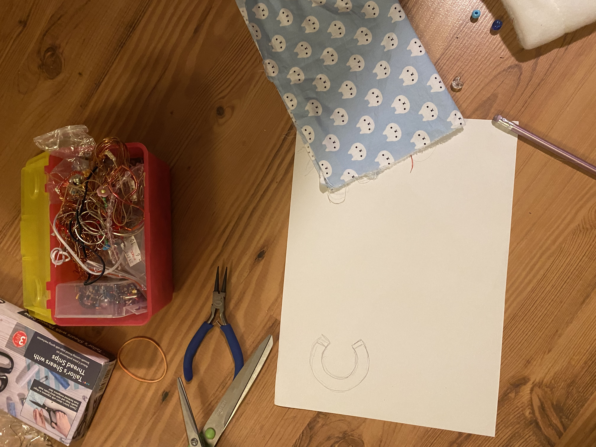
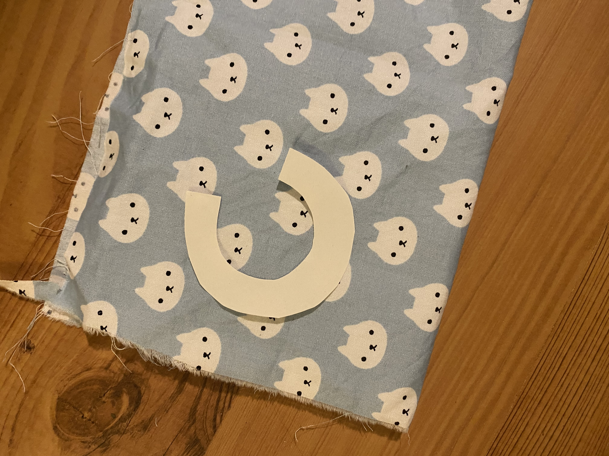
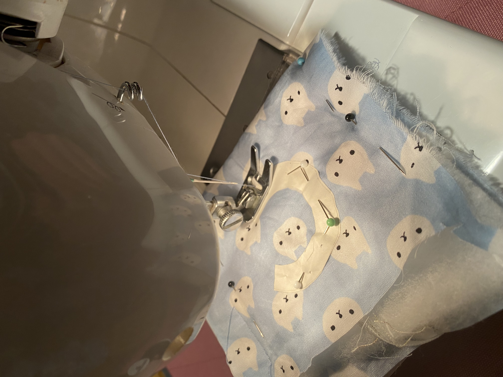
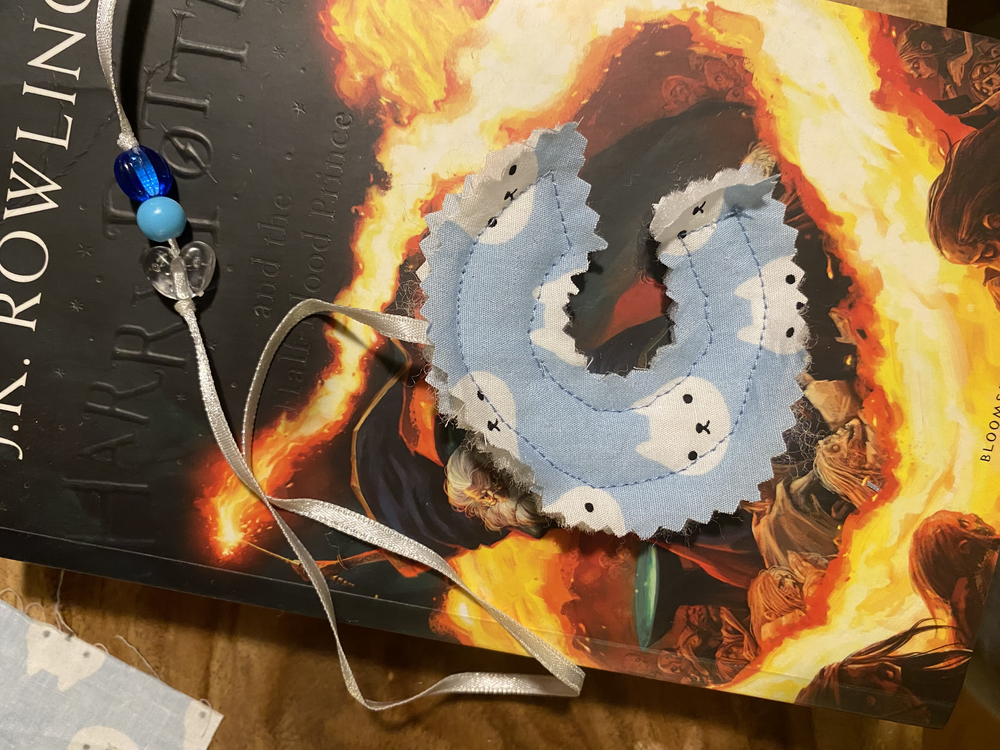
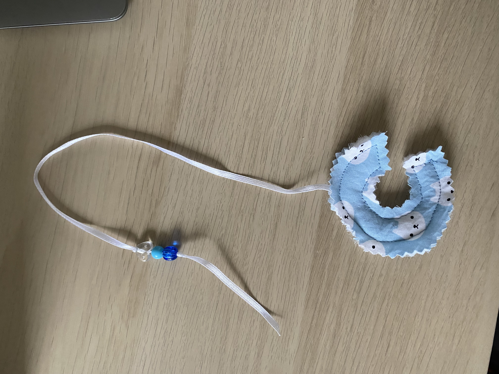

# 📝 Homework 7: First Impressions

## What I worked on

# Handshake

Hello!
I’m Barbora Berková, Head of Design at Keyspace Media.

I believe that design is the solution for our world to function—it's everything around us, shaping us and making our world a better place. I hold the view that small details truly matter, even the ones no one can see, because they define the quality of everything we create.

# About me page

I’m Barbora Berková, a designer and creative leader currently working as the Head of Design at Keyspace Media.

I hold the strong belief that design is the fundamental solution for our world to function. It is everything around us—shaping our experiences and striving to make the world a better place. For me, the smallest details truly matter, even the ones no one can consciously see, because they define the quality and integrity of everything we create. My love for good design runs deep; I can spend hours wandering through libraries just looking at the beauty of typography.

##
add something about my bachelor thesis: nowadays, I spend hours wandering through book stores, looking at childrens books. For my bachelor thesis, I am developing a kids brand, ... books, toys... I truly enjoy working on it, I am combining all the skills I have learned so far: drawing, writing, typography... 

MAYBE ADD A SOLO PAGE ABOUT MY BACHELOR THESIS?

##

My path to this career wasn’t straightforward. In fact, I once told my dad—who is a lifelong graphic designer—that I could never do what he does for a living.

But life had other plans.

Everything shifted when I traveled to the United States. I enrolled in two key courses: Digital Marketing and Business Procedures. Though I didn’t realize it then, those classes quietly marked the true beginning of my design journey.

I applied to university to study graphic and media design before graduating high school and got in. I won’t lie; I was completely lost at first. However, team projects quickly created an environment that pushed me, challenged me, and taught me how to think, communicate, and create effectively.

The Plunge into Professional Chaos

The real acceleration began when we started working directly with our teacher on live client projects: meetings, presentations, revisions, negotiations. It felt like being thrown into deep water without knowing how to swim. Yet, that chaos was formative. It taught me to be adaptable, curious, and confidently navigate creative uncertainty.

That intense, hands-on experience—combined with a shared desire to build something of our own—led to the birth of Keyspace, our creative agency.

Today, I channel everything I’ve learned into thoughtful design work that powerfully combines clarity, storytelling, and genuine human connection.

---
layout: default
title: "Homework 1"
---

# 📝 Homework 1: Bespoke Character

## What I worked on

Our homework was to design a bespoke character from the modern English alphabet:

- Choose a single letterform (A–Z)
- Use any style: lowercase or uppercase, sans-serif or serif, cursive, fantasy, etc.
- Use any technique: hand-drawn, analog, digital, or mixed media

I knew I wanted to sew something, but I wasn't sure what. My first step was to browse the fabrics, and a cat-patterned one immediately caught my eye. Inspired by the material, I decided on a cat-related project. This led to the idea of creating a letter 'C' that functions as both a cat toy and a bookmark. For my next assignment, I expanded on the bookmark idea by creating a cat poem. (this will lead to the cat poem page)

---

## Work in progress🧵🪡

<table>
  <tr>
    <td>
      
       <em>choosing the fabrics and threads</em>
    </td>
    <td>
      
       <em>preparing the letter: drawing of a letter c on a paper</em>
    </td>
  </tr>
  <tr>
    <td>
      
       <em>letter c on a cat patterned fabric</em>
    </td>
    <td>
      
       <em>sewing the letter</em>
    </td>
  </tr>
  <tr>
    <td>
      
       <em>letter c made out of cat patterned fabric</em>
    </td>
    <td></td> </tr>
</table>

## This is the final project!

[Go back to Home](./)
